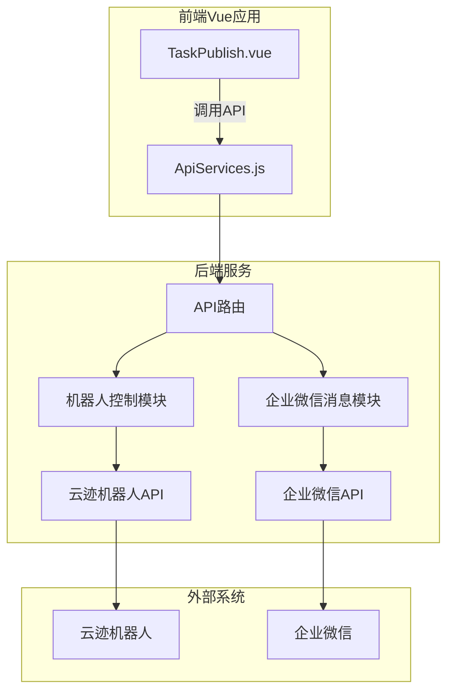
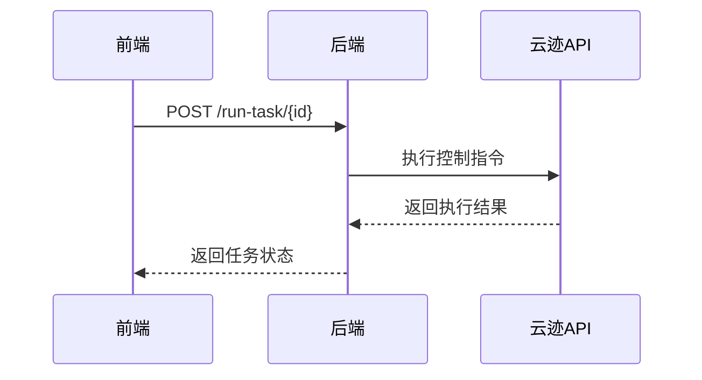
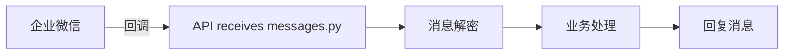

# 35中机器人控制系统代码逻辑文档

## 1. 系统架构图

## 2. 前端Vue组件交互

### 核心组件结构

- `TaskPublish.vue`: 任务发布主界面
  - 机器人选择区
  - 状态展示区
  - 任务流构建区

### 数据流

1. 用户操作触发API调用
2. ApiServices处理请求/响应
3. 状态管理更新UI

## 3. 后端API设计

### 主要接口

#### 机器人控制API

| 接口路径 | 方法 | 参数 | 返回值 | 描述 |
|---------|------|------|--------|------|
| `/robot_list` | GET | 无 | `{code: number, data: Array<Robot>}` | 获取所有机器人列表 |
| `/run-task/{id}` | POST | `{locations: string[]}` | `{code: number, message: string}` | 执行机器人任务 |
| `/device_status/{id}` | GET | 无 | `{code: number, data: DeviceStatus}` | 查询指定设备状态 |

#### 企业微信API

| 接口路径 | 方法 | 参数 | 返回值 | 描述 |
|---------|------|------|--------|------|
| `/hook_path` | GET/POST | `msg_signature`, `timestamp`, `nonce`, `echostr` | 验证字符串 | 企业微信回调验证 |
| `/send_message` | POST | `{user_id: string, message_content: string}` | `{errcode: number}` | 发送企业微信消息 |

### 调用流程

## 4. 机器人控制流程

### 指令映射表

| 前端指令 | 后端API调用 | 机器人动作 |
|---------|------------|-----------|
| 前往教室 | make_task_flow_move_target | 导航到指定位置 |
| 返回充电 | goto_charge | 返回充电桩 |

## 5. 企业微信集成

### 消息收发机制

## 6. 安全验证机制

### 认证流程

1. 前端添加Bearer Token
2. 后端验证access_token
3. 企业微信消息签名验证

## 7. 错误处理流程

### API错误码

| 错误码 | 含义 | 处理建议 |
|-------|------|---------|
| 0 | 成功 | - |
| 4001 | 无效参数 | 检查请求参数 |
| 4003 | 权限不足 | 检查用户权限 |
| 5001 | 服务器错误 | 重试或联系管理员 |

### 异常处理机制

1. 前端捕获异常并显示友好提示
2. 后端记录错误日志
3. 关键操作实现自动重试(最多3次)

### 企业微信消息错误处理

1. 签名验证失败返回HTTP 403
2. 消息解密失败记录日志
3. 业务处理异常返回错误响应
