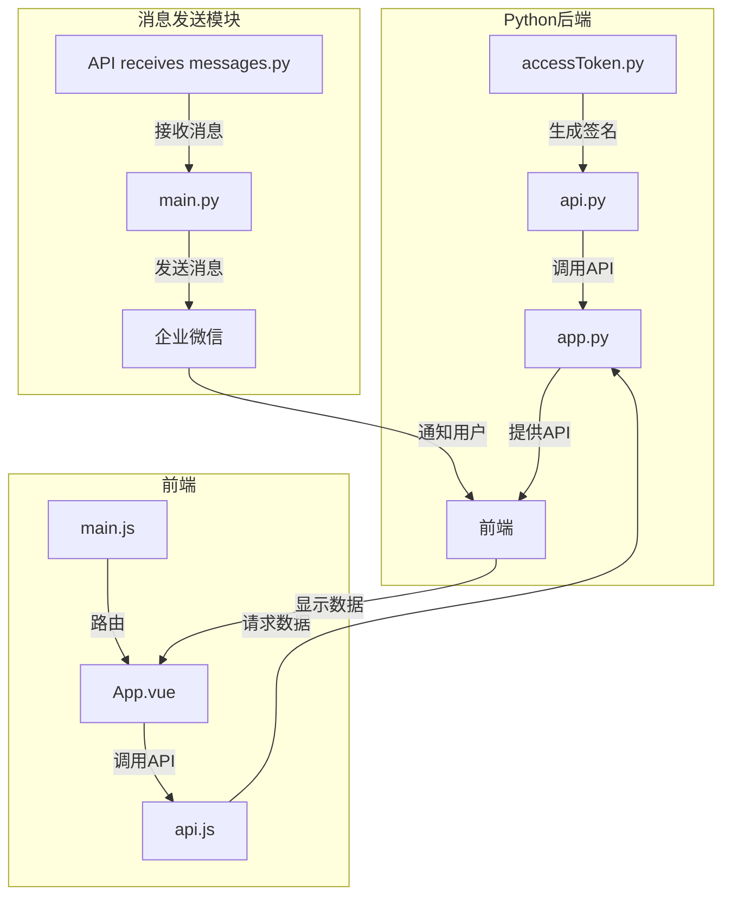

根据提供的代码文件内容，我需要分析项目的整体架构和主要模块，然后用mermaid语法绘制出项目的代码逻辑图。主要模块包括：
1. python-backend：处理API请求和认证
2. Send-message：处理企业微信消息发送
3. website：前端Vue项目

我将分别分析每个模块的主要功能，然后绘制它们之间的关系图。

我将使用mermaid语法来描述项目代码逻辑：

这个图展示了：
1. Python后端模块负责处理API请求和认证
2. 消息发送模块负责与企业微信交互
3. 前端Vue项目通过API与后端通信
4. 消息发送模块可以通知前端更新状态
